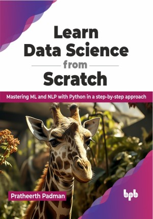

# Learn Data Science from Scratch

Turn raw data into meaningful solutions

This is the repository for [Learn Data Science from Scratch
](https://bpbonline.com/products/learn-data-science-from-scratch),published by BPB Publications.

## About the Book
Learn Data Science from Scratch equips you with the essential tools and techniques, from Python libraries to machine learning algorithms, to tackle real-world problems and make informed decisions.

This book provides a thorough exploration of essential data science concepts, tools, and techniques. Starting with the fundamentals of data science, you will progress through data collection, web scraping, data exploration and visualization, and data cleaning and pre-processing. You will build the required foundation in statistics and probability before diving into machine learning algorithms, deep learning, natural language processing, recommender systems, and data storage systems. With hands-on examples and practical advice, each chapter offers valuable insights and key takeaways, empowering you to master the art of data-driven decision making.

By the end of this book, you will be well-equipped with the essential skills and knowledge to navigate the exciting world of data science. You will be able to collect, analyze, and interpret data, build and evaluate machine learning models, and effectively communicate your findings, making you a valuable asset in any data-driven environment.

## What You Will Learn
• Master key data science tools like  Python, NumPy, Pandas, and more.

• Build a strong foundation in statistics and probability for data analysis.

• Learn and apply machine learning, from regression to deep learning.

• Expertise in NLP and recommender systems for advanced analytics.

• End-to-end data project from data collection to model deployment, with planning and execution.

